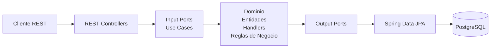
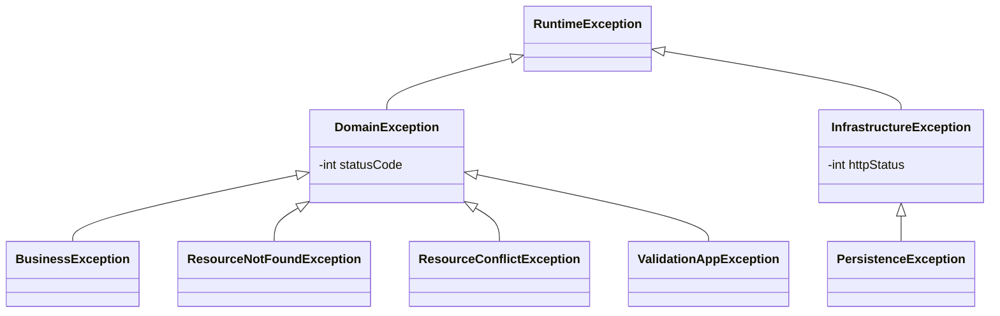
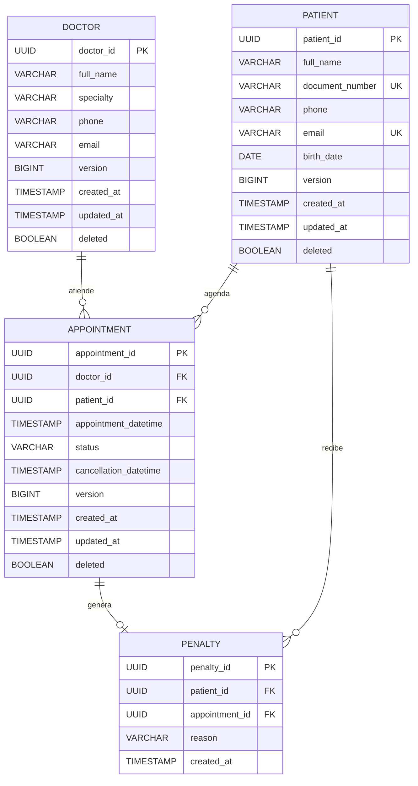

# 🏥 Medisalud - API de Gestión de Citas Médicas

Backend del sistema **Medisalud**, encargado de administrar el ciclo de vida de las citas médicas mediante una API REST.

El proyecto fue desarrollado siguiendo principios de **Arquitectura Hexagonal (Ports & Adapters)** con **CQRS**, aplicando rigurosamente **SOLID**, **DRY**, **nombres significativos** y **coherencia** en toda la base de código.

---

## Tecnologías y Versiones

| Tecnología | Versión |
|---|---|
| **Java** | **21** (LTS) |
| **Spring Boot** | **3.5.16** |
| Spring Data JPA | Incluida en Spring Boot 3.5.16 |
| Hibernate | Incluida en Spring Boot 3.5.16 |
| Flyway | `flyway-core` + `flyway-database-postgresql` (auto-configurado por Spring Boot) |
| PostgreSQL (Driver) | Runtime |
| Jakarta Validation | Incluida en Spring Boot 3.5.16 (`spring-boot-starter-validation`) |
| Lombok | Última compatible |
| Maven | 3.x (Maven Wrapper incluido) |
| JUnit 5 + Mockito | Incluidas en Spring Boot 3.5.16 (`spring-boot-starter-test`) |

---

## Arquitectura

La solución implementa una **Arquitectura Hexagonal (Ports & Adapters)** combinada con el patrón **CQRS (Command Query Responsibility Segregation)**, donde los **Commands** (escritura) y **Queries** (lectura) se separan en handlers distintos, cada uno con su propio puerto de entrada.



### CQRS en la práctica

Los casos de uso se organizan separando **Commands** (operaciones de escritura) de **Queries** (operaciones de lectura):

```
application/ports/
├── input/
│   ├── appointment/     ← Puertos de entrada (interfaces de casos de uso)
│   ├── doctor/
│   └── patient/
└── output/
    ├── appointment/     ← Puertos de salida (interfaces de persistencia)
    ├── doctor/
    └── patient/
```

Cada operación se encapsula en su propio **handler** dentro del paquete correspondiente, siguiendo la convención:

- `commands/<entidad>/<acción>/` → Handlers de escritura (crear, cancelar, reprogramar)
- `queries/<entidad>/<acción>/` → Handlers de lectura (obtener, listar, buscar)

### Principios de diseño aplicados

| Principio | Aplicación en el proyecto |
|---|---|
| **S** — Single Responsibility | Cada handler tiene una única responsabilidad: un comando o una query |
| **O** — Open/Closed | Los puertos (interfaces) permiten extender sin modificar el dominio |
| **L** — Liskov Substitution | Las excepciones de dominio son intercambiables a través de `DomainException` |
| **I** — Interface Segregation | Puertos de entrada y salida separados por entidad y operación |
| **D** — Dependency Inversion | El dominio define interfaces; la infraestructura las implementa |
| **DRY** | Lógica reutilizable centralizada; validaciones y mapeos sin duplicación |
| **Nombres significativos** | Clases, métodos y variables con nombres autoexplicativos |
| **Coherencia** | Convención uniforme en estructura de paquetes, nombrado y formato de respuestas |

### Beneficios de esta arquitectura

**Dominio independiente** — Las reglas críticas del negocio no dependen de Spring Boot, Hibernate ni PostgreSQL. Esto permite cambiar cualquier tecnología sin modificar la lógica de negocio.

**Alta mantenibilidad** — Cada capa posee una única responsabilidad:

- Controladores → HTTP
- Casos de uso → Orquestación
- Dominio → Reglas de negocio
- Infraestructura → Persistencia

**Alta capacidad de pruebas** — El dominio puede probarse utilizando únicamente JUnit y Mockito, sin necesidad de levantar Spring Boot ni una base de datos.

**Transacciones consistentes** — Procesos complejos como la reprogramación de una cita se ejecutan de forma atómica, garantizando consistencia mediante rollback automático ante cualquier error.

---

## Manejo de Excepciones

El sistema implementa un **manejo centralizado de excepciones** a través de `GlobalExceptionHandler` (`@RestControllerAdvice`). Cada excepción se mapea a un código HTTP específico.

### Jerarquía de excepciones



### Tabla de excepciones y códigos HTTP

| Excepción | Capa | HTTP Status | Cuándo se lanza |
|---|---|---|---|
| `BusinessException` | Dominio | `400 Bad Request` | Violación de una regla de negocio (ej: cita fuera de horario laboral, cita en domingo) |
| `ValidationAppException` | Dominio | `400 Bad Request` | Errores de validación de campos (lista de errores en el body). También captura `MethodArgumentNotValidException` de Jakarta Validation |
| `ResourceNotFoundException` | Dominio | `404 Not Found` | El recurso solicitado no existe (ej: doctor, paciente o cita no encontrada) |
| `ResourceConflictException` | Dominio | `409 Conflict` | Conflicto con el estado actual del recurso (ej: horario ya ocupado, cita duplicada) |
| `PersistenceException` | Infraestructura | `500 Internal Server Error` | Error al interactuar con la base de datos |
| `InfrastructureException` | Infraestructura | Configurable (default `500`) | Error técnico genérico de infraestructura |
| `Exception` (fallback) | Global | `500 Internal Server Error` | Cualquier excepción no controlada. Se registra como error crítico |

### Formato de respuesta de error

Todas las respuestas de error siguen el mismo formato estándar `ApiResponse`:

```json
{
  "success": false,
  "message": "Business validation failed.",
  "data": null
}
```

Para errores de validación, se incluye una lista de errores detallados:

```json
{
  "success": false,
  "message": "Validation failed",
  "data": [
    "El campo patientId no puede ser nulo",
    "La fecha debe ser futura"
  ]
}
```

---

## Arranque inicial con Flyway

El proyecto utiliza **Flyway** para la gestión de migraciones de base de datos. Al iniciar la aplicación por primera vez, Flyway ejecuta automáticamente el script `V1__initial_schema.sql` que crea todo el esquema inicial.

### Prerrequisitos

1. **Java 21** instalado y configurado en el `PATH`
2. **PostgreSQL** en ejecución (versión 16+)
3. **Maven 3.x** (o usar el Maven Wrapper incluido `mvnw` / `mvnw.cmd`)

### Paso 1 — Crear la base de datos

Conectarse a PostgreSQL y crear la base de datos:

```sql
CREATE DATABASE medisaludDB;
```

> **Nota:** No es necesario crear tablas ni insertar datos manualmente. Flyway se encarga de todo.

### Paso 2 — Configurar la conexión

Editar el archivo `src/main/resources/application.properties`:

```properties
# Conexión a PostgreSQL
spring.datasource.url=jdbc:postgresql://localhost:5432/medisaludDB
spring.datasource.username=postgres
spring.datasource.password=admin
spring.datasource.driver-class-name=org.postgresql.Driver

# Flyway: aplica el baseline si la BD ya existe sin historial de migraciones
spring.flyway.baseline-on-migrate=true
spring.flyway.baseline-version=1

# Hibernate solo VALIDA el esquema (Flyway se encarga de crearlo)
spring.jpa.hibernate.ddl-auto=validate
```

### Paso 3 — Compilar y ejecutar

```bash
# Compilar el proyecto
./mvnw clean package

# Ejecutar la aplicación
./mvnw spring-boot:run
```

o alternativamente:

```bash
java -jar target/appointment-api-0.0.1-SNAPSHOT.jar
```

### ¿Qué ocurre al arrancar?

1. Spring Boot inicia y conecta con PostgreSQL.
2. **Flyway** detecta que no existe la tabla `flyway_schema_history` y la crea automáticamente.
3. Flyway escanea `src/main/resources/db/migration/` y encuentra `V1__initial_schema.sql`.
4. Ejecuta el script que:
   - Crea las tablas: `doctor`, `patient`, `appointment`, `penalty`
   - Crea los índices de rendimiento
   - Inserta datos iniciales de doctores de ejemplo
   - Crea índices únicos parciales para evitar citas duplicadas
5. **Hibernate** valida que las entidades JPA coincidan con el esquema creado por Flyway.
6. La API queda disponible en `http://localhost:8080`.

### Esquema creado por `V1__initial_schema.sql`



### Datos iniciales incluidos

La migración inserta **3 doctores** de ejemplo:

| Nombre | Especialidad | Email |
|---|---|---|
| Dra. María González | Cardiología | maria.gonzalez@medisalud.com |
| Dr. Carlos Ruiz | Pediatría | carlos.ruiz@medisalud.com |
| Dra. Ana López | Dermatología | ana.lopez@medisalud.com |

---

## Estructura del proyecto

```
├── src/
│   ├── main/
│   │   ├── java/
│   │   │   └── com/medisalud/appointment/
│   │   │       ├── application/
│   │   │       │   └── ports/
│   │   │       │       ├── input/              ← Puertos de entrada (use cases)
│   │   │       │       │   ├── appointment/
│   │   │       │       │   ├── doctor/
│   │   │       │       │   └── patient/
│   │   │       │       └── output/             ← Puertos de salida (persistencia)
│   │   │       │           ├── appointment/
│   │   │       │           ├── doctor/
│   │   │       │           └── patient/
│   │   │       ├── domain/
│   │   │       │   ├── enums/                  ← Enumeraciones del dominio
│   │   │       │   ├── errorMessage/           ← Mensajes de error centralizados
│   │   │       │   ├── exceptions/             ← Excepciones de dominio
│   │   │       │   ├── model/                  ← Modelos de dominio (entidades puras)
│   │   │       │   └── wrapper/                ← ApiResponse wrapper
│   │   │       ├── infrastructure/
│   │   │       │   ├── exceptions/             ← Excepciones de infraestructura
│   │   │       │   ├── global/                 ← GlobalExceptionHandler + Configs
│   │   │       │   ├── persistence/
│   │   │       │   │   ├── adapter/            ← Adaptadores (implementan output ports)
│   │   │       │   │   ├── entity/             ← Entidades JPA
│   │   │       │   │   └── repository/         ← Repositorios Spring Data
│   │   │       │   └── rest/                   ← Controladores REST
│   │   │       └── AppointmentApiApplication.java
│   │   └── resources/
│   │       ├── application.properties
│   │       └── db/
│   │           └── migration/
│   │               └── V1__initial_schema.sql  ← Migración inicial Flyway
│   └── test/
│       └── java/
│           └── com/medisalud/appointment/      ← Pruebas unitarias
```

---

## Características

- Agendamiento de citas médicas.
- Consulta de horarios disponibles.
- Cancelación de citas.
- Reprogramación de citas.
- Validación de reglas de negocio.
- Penalizaciones automáticas por cancelaciones tardías.
- Arquitectura Hexagonal con CQRS.
- Pruebas unitarias.

---

## Convención de respuestas

Todas las respuestas siguen el formato estándar `ApiResponse`:

**Éxito:**

```json
{
  "success": true,
  "message": "Operation completed successfully.",
  "data": {}
}
```

**Error:**

```json
{
  "success": false,
  "message": "Business validation failed.",
  "data": null
}
```

---

## Endpoints

### Obtener horarios disponibles

Obtiene las franjas horarias disponibles para un médico dentro de un rango de fechas.

```
GET /api/v1/appointments/available-slots
```

**Parámetros:**

| Parámetro | Tipo |
|---|---|
| doctorId | UUID |
| startDate | LocalDate |
| endDate | LocalDate |

**Ejemplo:**

```
GET /api/v1/appointments/available-slots?doctorId=d3b07384-d113-49cd-a5d6-8802d8471900&startDate=2026-08-22&endDate=2026-08-22
```

**Respuesta:**

```json
{
  "success": true,
  "message": "Available time slots retrieved successfully.",
  "data": [
    "2026-08-22T08:00:00",
    "2026-08-22T08:30:00",
    "2026-08-22T09:00:00"
  ]
}
```

---

### Agendar cita

```
POST /api/v1/appointments
```

```json
{
  "patientId": "c8e17812-4211-4091-8177-3e1989011111",
  "doctorId": "d3b07384-d113-49cd-a5d6-8802d8471900",
  "appointmentDatetime": "2026-08-25T14:30:00"
}
```

**Respuesta:**

```json
{
  "success": true,
  "message": "Appointment scheduled successfully.",
  "data": "a1b2c3d4-e5f6-7a8b-9c0d-1e2f3a4b5c6d"
}
```

---

### Cancelar cita

```
PATCH /api/v1/appointments/{appointmentId}/cancel
```

**Respuesta:**

```json
{
  "success": true,
  "message": "Appointment has been canceled successfully.",
  "data": null
}
```

---

### Reprogramar cita

```
POST /api/v1/appointments/reschedule
```

```json
{
  "appointmentId": "a1b2c3d4-e5f6-7a8b-9c0d-1e2f3a4b5c6d",
  "newScheduledAt": "2026-08-28T10:00:00"
}
```

**Respuesta:**

```json
{
  "success": true,
  "message": "Appointment rescheduled successfully.",
  "data": "f8c3d2e1-b4a5-9c8d-7e6f-0a1b2c3d4e5f"
}
```

---

## Reglas de negocio implementadas

- Un médico no puede tener dos citas en el mismo horario.
- Un paciente no puede tener citas superpuestas.
- Las citas tienen una duración de **30 minutos**.
- Solo se permiten citas dentro del horario laboral.
- Los domingos no existen horarios disponibles.
- Una cancelación realizada con menos de **2 horas** de anticipación genera una penalización automática.
- La reprogramación valida disponibilidad antes de cancelar la cita anterior.
- Todas las operaciones críticas se ejecutan dentro de una transacción.

---

## Pruebas

Ejecutar todas las pruebas:

```bash
./mvnw test
```

---

## Principios aplicados

- Arquitectura Hexagonal (Ports & Adapters)
- CQRS (Handlers separados para Commands y Queries)
- Domain-Driven Design (DDD)
- SOLID
- DRY (Don't Repeat Yourself)
- Clean Code
- Nombres significativos
- Coherencia en estructura y convenciones
- Dependency Inversion
- Validación mediante Jakarta Validation
- Manejo centralizado de excepciones
- Transacciones ACID