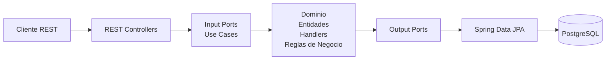

# 🏥 Medisalud - API de Gestión de Citas Médicas

Backend del sistema **Medisalud**, encargado de administrar el ciclo de vida de las citas médicas mediante una API REST.

El proyecto fue desarrollado siguiendo principios de **Arquitectura Hexagonal**, **Domain-Driven Design (DDD)** y **Clean Code**, garantizando una solución desacoplada, mantenible, escalable y altamente testeable.

---

# Características

- Agendamiento de citas médicas.
- Consulta de horarios disponibles.
- Cancelación de citas.
- Reprogramación de citas.
- Validación de reglas de negocio.
- Penalizaciones automáticas por cancelaciones tardías.
- Arquitectura Hexagonal.
- Pruebas unitarias.

---

# Arquitectura

La solución implementa una **Arquitectura Hexagonal (Ports & Adapters)** donde el dominio permanece completamente aislado de cualquier tecnología externa.



## Beneficios de esta arquitectura

### Dominio independiente

Las reglas críticas del negocio no dependen de Spring Boot, Hibernate ni PostgreSQL.

Esto permite cambiar cualquier tecnología sin modificar la lógica de negocio.

### Alta mantenibilidad

Cada capa posee una única responsabilidad.

- Controladores → HTTP
- Casos de uso → Orquestación
- Dominio → Reglas de negocio
- Infraestructura → Persistencia

### Alta capacidad de pruebas

El dominio puede probarse utilizando únicamente JUnit y Mockito, sin necesidad de levantar Spring Boot ni una base de datos.

### Transacciones consistentes

Procesos complejos como la reprogramación de una cita se ejecutan de forma atómica, garantizando consistencia mediante rollback automático ante cualquier error.

---

# Tecnologías

| Tecnología | Versión |
|------------|----------|
| Java | 25 |
| Spring Boot | 3.x |
| Spring Data JPA | 3.x |
| Hibernate | 6.x |
| PostgreSQL | 16+ |
| Maven | 3.x |
| Jakarta Validation | Última |
| JUnit 5 | Última |
| Mockito | Última |

---

# Estructura del proyecto

```
src
├── domain
│   ├── model
│   ├── ports
│   ├── handlers
│   └── exceptions
│
├── application
│   ├── usecases
│   ├── commands
│   └── queries
│
├── infrastructure
│   ├── adapters
│   │   ├── input
│   │   └── output
│   ├── persistence
│   ├── controllers
│   └── configuration
│
└── MedisaludApplication.java
```

---

# Requisitos

- Java 25
- Maven 3.x
- PostgreSQL

---

# Configuración

Editar el archivo:

```
src/main/resources/application.properties
```

Configurar:

```properties
spring.datasource.url=jdbc:postgresql://localhost:5432/medisalud
spring.datasource.username=postgres
spring.datasource.password=postgres
```

---

# Ejecución

## Compilar

```bash
./mvnw clean package
```

## Ejecutar

```bash
./mvnw spring-boot:run
```

o

```bash
java -jar target/medisalud-appointment-0.0.1-SNAPSHOT.jar
```

La API quedará disponible en

```
http://localhost:8080
```

---

# Convención de respuestas

Todas las respuestas siguen el mismo formato.

```json
{
  "success": true,
  "message": "Operation completed successfully.",
  "data": {}
}
```

Errores:

```json
{
  "success": false,
  "message": "Business validation failed.",
  "data": null
}
```

---

# Endpoints

## Obtener horarios disponibles

Obtiene las franjas horarias disponibles para un médico dentro de un rango de fechas.

### GET

```
GET /api/v1/appointments/available-slots
```

### Parámetros

| Parámetro | Tipo |
|------------|------|
| doctorId | UUID |
| startDate | LocalDate |
| endDate | LocalDate |

Ejemplo:

```
GET /api/v1/appointments/available-slots?doctorId=d3b07384-d113-49cd-a5d6-8802d8471900&startDate=2026-08-22&endDate=2026-08-22
```

Respuesta

```json
{
  "success": true,
  "message": "Available time slots retrieved successfully.",
  "data": [
    "2026-08-22T08:00:00",
    "2026-08-22T08:30:00",
    "2026-08-22T09:00:00"
  ]
}
```

---

## Agendar cita

### POST

```
POST /api/v1/appointments
```

```json
{
  "patientId": "c8e17812-4211-4091-8177-3e1989011111",
  "doctorId": "d3b07384-d113-49cd-a5d6-8802d8471900",
  "appointmentDatetime": "2026-08-25T14:30:00"
}
```

Respuesta

```json
{
  "success": true,
  "message": "Appointment scheduled successfully.",
  "data": "a1b2c3d4-e5f6-7a8b-9c0d-1e2f3a4b5c6d"
}
```

---

## Cancelar cita

### PATCH

```
PATCH /api/v1/appointments/{appointmentId}/cancel
```

Respuesta

```json
{
  "success": true,
  "message": "Appointment has been canceled successfully.",
  "data": null
}
```

---

## Reprogramar cita

### POST

```
POST /api/v1/appointments/reschedule
```

```json
{
  "appointmentId": "a1b2c3d4-e5f6-7a8b-9c0d-1e2f3a4b5c6d",
  "newScheduledAt": "2026-08-28T10:00:00"
}
```

Respuesta

```json
{
  "success": true,
  "message": "Appointment rescheduled successfully.",
  "data": "f8c3d2e1-b4a5-9c8d-7e6f-0a1b2c3d4e5f"
}
```

---

# Reglas de negocio implementadas

- Un médico no puede tener dos citas en el mismo horario.
- Un paciente no puede tener citas superpuestas.
- Las citas tienen una duración de **30 minutos**.
- Solo se permiten citas dentro del horario laboral.
- Los domingos no existen horarios disponibles.
- Una cancelación realizada con menos de **2 horas** de anticipación genera una penalización automática.
- La reprogramación valida disponibilidad antes de cancelar la cita anterior.
- Todas las operaciones críticas se ejecutan dentro de una transacción.

---

# Pruebas

Ejecutar todas las pruebas:

```bash
./mvnw test
```

---

# Principios aplicados

- Arquitectura Hexagonal
- Domain-Driven Design (DDD)
- SOLID
- Clean Code
- Ports & Adapters
- Dependency Inversion
- CQRS (Handlers para Commands y Queries)
- Validación mediante Jakarta Validation
- Manejo centralizado de excepciones
- Transacciones ACID